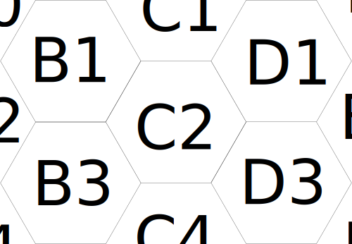
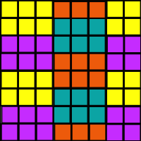
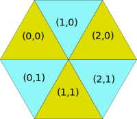
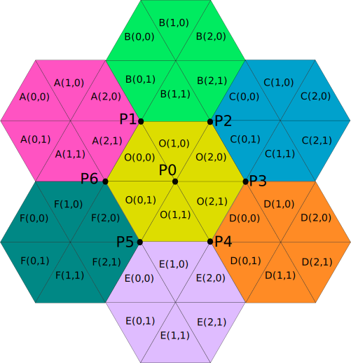

# Hex Grid Implementation

The game is based around what looks to the end user like a hex grid:



Under the covers, each hex item is split into 6 equilateral triangles:


This gives us some flexibility to have a wide variety of hex items for the player to lay down, while limiting the underlying mechanics to something much simpler.

Additionally, this has the added benefit of making general computations around grid coordinates much simpler


It can now be internalized as a grid system, where each hex is the equivalent to a 3x2 rectangle.

If we visualize an actor within a triangle moving to another triangle, the legal moves now become:

1. Left-Right is allowed in all cases.
2. Up-Down is only allowed where (row index + column index) is even (or odd; choose just one).  Otherwise, a diagonal direction may be preferable.

Likewise, there's nothing preventing us from rotating this 30 degrees, so that Up-Down is allowed in all cases, and the hexes are equivalent to a 2x3 rectangle.

## Coordinate System

With this in mind, the hex grid implementation established a coordinate system based on the triangles, as that's what's stored for the map.  Each triangle is assigned a simple integer pair `(column, row)`.  As shown in the images above, the triangles line up with each other nicely.

Rather than just arbitrarily choosing an even or odd system, let's see what we can do with math to prevent branching logic.

We can find the even/odd-ness of the triangle by adding the `column` and `row` index together, and seeing if it's even or odd.  This is commonly done by masking out all but the first bit:

```python
odd_ness = (column + row) & 0x1
```

If we want to turn this into a "which of up/down is allowed for this triangle" answer, or pick either 1 or -1, we can multiply the 1 / 0 value by 2 (giving us 2 or 0), then subtracting 1:

```python
up_down_direction = ((odd_ness) << 1) - 1
```

With this bit of math and a coordinate system where going down increases the row index, we have even triangles go up (meaning they are point-downwards) and odd triangles go down (meaning they are point-upwards).  If we really want the inverse, we can use `1 - up_down_direction`.

## Valid Hex Placements

Now that we know how the triangles point based on their row/column index, let's find out where in this coordinate system hexes can be placed.

Since we're using a rectangular coordinate system now for triangles, let's instead replace them with squares.



Here, we can see that on the columns (left-right), a hex is placed every three spots.  For the rows (up-down), it's either on the even or odd row.

Let's refer to the hex by its upper-left triangle, so that the first hexagon is placed at `(0, 0)`, meaning its upper-left triangle is on `(0, 0)`.

In this setup, a hexagon can be placed at:

* valid column value: if column modulo 3 == 0.
* valid row value: (if column modulo 6 == 0 and row modulo 2 == 0) or (if column modulo 6 == 3 and row modulo 2 == 1).


## Hex Height and Triangle Y Position

The game involves heights (y level) on each placed token.  If we want the triangles within the hexes to connect nicely (an even triangle grid rather than stepping-stone looking tokens), then we have to figure out what the "y" means for the triangles.

In terms of the hexes, the height for the hex token is the center point.  The other points on the triangles in that hex are an average in "y" level between this hex and the connected hexes (exactly 3 connected hexes for every point).

Data-wise, the triangles in the hex token store only the height for the source hex token.  This means the rendering engine needs to extrapolate the correct "y" value for each of the triangle's vertices.

The hex-to-tile format is a 3x2 grid that represents:



with the coordinates being relative offsets to the token placement.

Based on the [above description on valid hex placements](#valid-hex-placements), we can perform a reverse lookup for a triangle-to-hex index:

```python
hex_column = triangle_grid_column % 3
if triangle_grid_column % 6 < 3:
    hex_row = triangle_grid_row % 2
else:
    hex_row = (row + 1) % 2
```

For each of the verticies on each of the triangles, the connected triangles in adjacent hex tokens must be found.  The layout looks like this:



All point on a triangle has 6 adjacent triangles.  The simple case is `P0` - the center of the 'O' (for origin, the under-inspection) hex token; its "y" value is the token's height.  For the other 6 points, there are only 3 hex token heights, so averaging all 6 would be redundant.

Using the algorithm above for finding the internal hex token coordinates, we can use that with a lookup table to find the relative triangle grid coordinate for each of the triangles used to contribute to the height average.  One of these relative coordinates will be `(0, 0)`, to represent the current triangle's height.  If we want to use simple logic rather than lots of special cases (but possibly faster), `P0` would only need to contain three `(0, 0)` values.


## Old Cruft

(Old stuff that seemed useful but now not so much)

The system also established an *even* movement system:

```python
from typing import Tuple
Coordinate = Tuple[int, int]
LEFT: Coordinate = (-1, 0)
RIGHT: Coordinate = (1, 0)
UP: Coordinate = (0, -1)
DOWN: Coordinate = (0, 1)

def get_adjacent_tiles(current: Coordinate) -> Tuple[Coordinate, Coordinate, Coordinate]:
    if is_even(current):
        return (
            move(current, LEFT),
            move(current, RIGHT),
            move(current, UP),
        )
    return (
        move(current, LEFT),
        move(current, RIGHT),
        move(current, DOWN),
    )

def is_even(current: Coordinate) -> bool:
    return (current[0] + current[1]) & 0x1 == 0

def move(current: Coordinate, amount: Coordinate) -> Coordinate:
    return (current[0] + amount[0], current[1] + amount[1])
```
